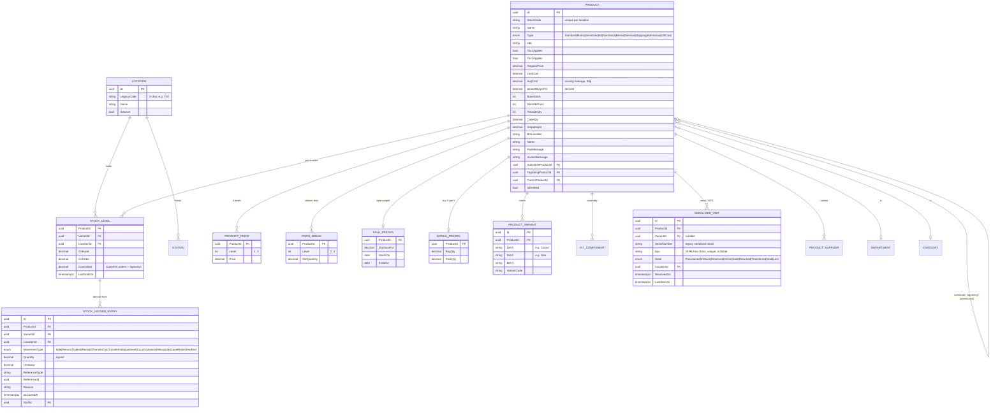
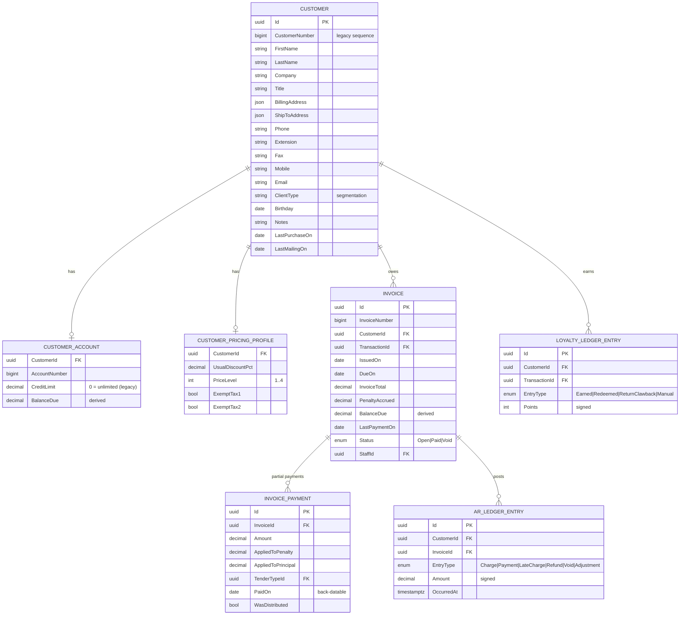
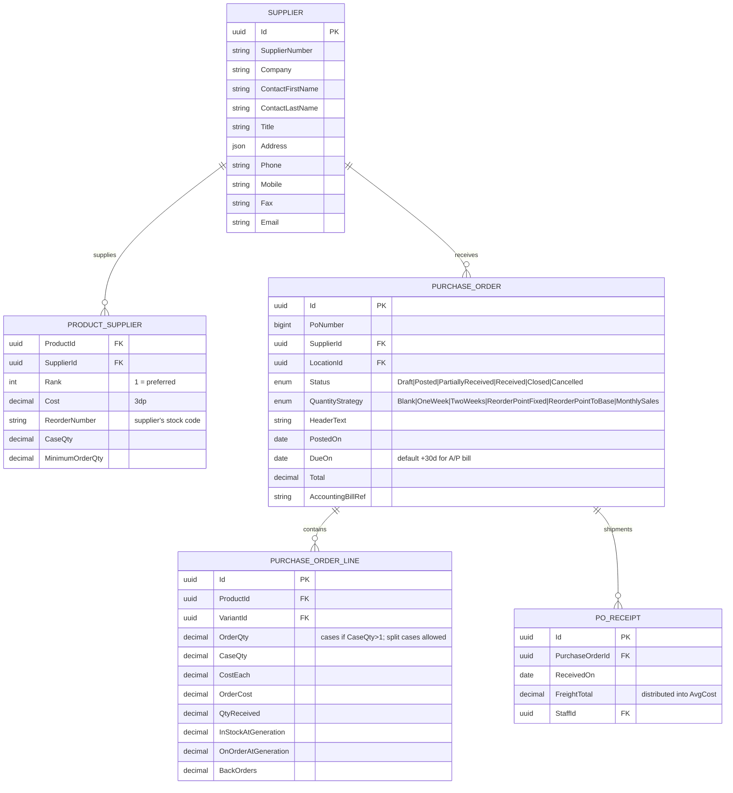
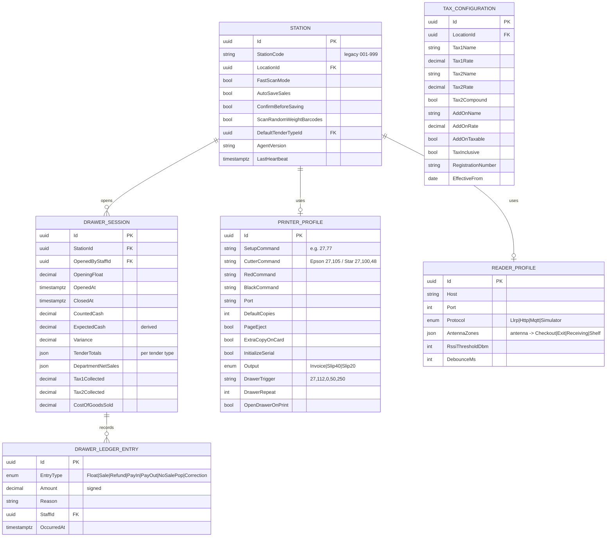

# 03 — Domain Model & ERD

## Modelling principles

1. **Ledgers over mutable counters.** `StockLedgerEntry`, `ARLedgerEntry`, `DrawerLedgerEntry` and
   `LoyaltyLedgerEntry` are append-only. `StockLevel.OnHand`, `Invoice.BalanceDue`,
   `Customer.RewardPoints` are *derived snapshots* maintained in the same transaction as the ledger
   write, and are rebuildable by replay. This directly replaces the legacy
   `Rebuild`/`Reindex`/"undo the year-end close" recovery story.
2. **Snapshot everything a document prints.** Guide p.56: a reprint must show the taxes in effect
   at sale time. `SaleLine` and `SaleTaxSnapshot` copy the resolved values; they never join back to
   current configuration.
3. **Aggregate boundaries = transaction boundaries.** One `SaveChanges` per command. Cross-aggregate
   effects go through domain events → outbox.
4. **Money = `decimal(19,4)`** stored, rounded to currency scale only at document/tender boundaries.
   `Quantity = decimal(18,4)` (random-weight items and split cases need fractions).
   Cost fields allow 3 decimals per guide p.37.
5. **Soft delete + audit columns everywhere** (`IsDeleted`, `CreatedAt/By`, `ModifiedAt/By`,
   `RowVersion` — see the note in [12](12-schema-reference.md), it is not yet wired). The legacy "Undelete Items" command becomes real.

---

## Core ERD — Catalog & Inventory



**Notes**

- `SERIALIZED_UNIT` unifies the legacy serial-number list (guide p.42) with RFID EPCs. A store with
  no RFID uses `SerialNumber` only; an RFID store uses `Epc`; both may be set. Unique partial
  indexes on each.
- `ProductType.GiftCard` forces `Tax1Applies=Tax2Applies=false` at write time (guide p.106 caution).
- Case break (parent/child, guide p.43) is a two-line `StockLedgerEntry` pair with
  `MovementType=CaseBreak`.
- `GrossMarginPct` is computed `((price - cost)/price)*100` (guide p.32) — stored generated column.

---

## Sales ERD

```mermaid
erDiagram
    CART ||--o{ CART_LINE : contains
    CART ||--o{ CART_ADJUSTMENT : has
    CART ||--o| CART_TAX_OVERRIDE : has
    CART }o--o| CUSTOMER : "bill to"
    CART {
        uuid Id PK
        uuid StationId FK
        uuid LocationId FK
        uuid StaffId FK
        uuid CustomerId FK
        enum Status "Active|Suspended|Completed|Voided"
        string HeldName "F4 Suspend label"
        timestamptz CreatedAt
        timestamptz ExpiresAt
    }
    CART_LINE {
        uuid Id PK
        uuid ProductId FK
        uuid VariantId FK
        uuid SerializedUnitId FK
        enum Source "Rfid|Barcode|StockCode|Manual|Unknown|KitComponent"
        decimal Quantity
        decimal UnitPrice "resolved"
        enum PriceOrigin "Regular|Level2|Level3|Level4|Break|Sale|Bonus|Manual|RandomWeight|ClientLevel"
        decimal LineDiscountPct
        bool Tax1Applies
        bool Tax2Applies
        bool ReturnToStock
        enum LineType "Sale|Return|TradeIn"
    }
    CART_ADJUSTMENT {
        uuid Id PK
        enum Type "SubtotalDiscount|Coupon|BottleReturn|GiftCertificate|LoyaltyReward"
        string Label
        decimal Amount
        decimal Percent
        string Serial "gift certificate"
    }
    SALES_TRANSACTION ||--o{ SALE_LINE : contains
    SALES_TRANSACTION ||--o{ SALE_TENDER : "split tender (N)"
    SALES_TRANSACTION ||--|| SALE_TAX_SNAPSHOT : freezes
    SALES_TRANSACTION }o--o| CUSTOMER : "sold to"
    SALES_TRANSACTION ||--o| INVOICE : "if on account"
    SALES_TRANSACTION {
        uuid Id PK
        bigint TransactionNumber "per-location sequence"
        uuid LocationId FK
        uuid StationId FK
        uuid StaffId FK
        uuid CustomerId FK
        uuid DrawerSessionId FK
        decimal Subtotal
        decimal DiscountTotal
        decimal AddOnChargeTotal
        decimal Tax1Total
        decimal Tax2Total
        decimal GrandTotal
        decimal CostOfGoodsSold
        int LoyaltyPointsEarned
        int LoyaltyPointsRedeemed
        enum Status "Completed|Voided"
        uuid VoidedByTransactionId FK
        timestamptz CompletedAt
    }
    SALE_LINE {
        uuid Id PK
        uuid ProductId FK
        string StockCodeSnapshot
        string NameSnapshot
        decimal Quantity
        decimal UnitPrice
        decimal DiscountPct
        decimal ExtendedNet
        decimal Tax1Amount
        decimal Tax2Amount
        decimal UnitCostSnapshot
        enum PriceOrigin
    }
    SALE_TENDER {
        uuid Id PK
        uuid TenderTypeId FK
        decimal Amount "in base currency"
        decimal AmountTendered
        decimal ChangeGiven
        uuid CurrencyId FK
        decimal ExchangeRate
        string AuthCode
        string CardLast4
        string GatewayReference
    }
    SALE_TAX_SNAPSHOT {
        uuid TransactionId FK
        string Tax1Name
        decimal Tax1Rate
        string Tax2Name
        decimal Tax2Rate
        bool Tax2Compound
        string AddOnName
        decimal AddOnRate
        bool AddOnTaxable
        bool TaxInclusive
        string TaxRegistrationNumber
    }
    CUSTOMER_ORDER {
        uuid Id PK
        uuid CustomerId FK
        uuid ProductId FK
        decimal Quantity
        decimal Prepaid
        enum Status "Open|Filled|Cancelled"
    }
    LAYAWAY {
        uuid Id PK
        uuid CustomerId FK
        decimal Total
        decimal PaidToDate
        enum Status "Open|Completed|Cancelled"
    }
    PRICE_QUOTE {
        uuid Id PK
        uuid CustomerId FK
        date ExpiresOn
        enum Status "Open|Converted|Expired"
    }
```



**Notes**

- A `Cart` becomes a `SalesTransaction` via `CompleteSaleCommand`; carts are never deleted, they
  transition to `Completed`/`Voided`.
- **Void = reversal, never deletion** (guide p.14 voids from the sales log; p.57 keeps a void
  notice). `VoidedByTransactionId` links the reversing transaction.
- `SALE_TENDER` supports *N* tenders — a superset of the legacy 2-way split (guide p.8).
- `CostOfGoodsSold` is captured at sale time from `AvgCost` (legacy tracks COGS on the sales log,
  p.14, and on tax reports, p.15).

---

## Customers, AR & Loyalty ERD



**Legacy AR rules encoded here** (guide p.56, p.58):
- Partial payment applies to **penalty first**, remainder to principal → `AppliedToPenalty` /
  `AppliedToPrincipal` are explicit columns, not inferred.
- Next penalty accrues from `LastPaymentOn`, not `IssuedOn`.
- Penalty only offered when `today - IssuedOn > GracePeriodDays`.
- Distribute payment walks open invoices **oldest first** until exhausted.

---

## Purchasing ERD



---

## Terminals, Drawer & Configuration ERD



`TAX_CONFIGURATION` is **effective-dated** so a rate change never rewrites history — combined with
`SALE_TAX_SNAPSHOT` this makes reprint-fidelity a structural guarantee.

---

## Identity & audit (detail in [07](07-security-and-identity.md))

```
AspNetUsers / AspNetRoles / AspNetUserRoles        (ASP.NET Core Identity)
OpenIddictApplications / Authorizations / Scopes / Tokens
StaffProfile          → UserId, StaffCode, PIN hash, commission defaults, AccessLevel(0-4 legacy map)
TimeClockEntry        → clock in/out, computed hours
Permission            → seeded catalogue; Role↔Permission many-to-many
AuditLogEntry         → actor, action, entity, before/after JSONB, station, ip, at
OutboxMessage         → id, type, payload JSONB, occurredAt, processedAt, attempts, error
IdempotencyRecord     → key, endpoint, requestHash, responseSnapshot, expiresAt
```

## Concurrency & integrity rules

| Concern | Mechanism |
|---|---|
| Two stations selling the last unit | `SELECT … FOR UPDATE` on `StockLevel` row inside the sale transaction; serialized units additionally guarded by an EPC state CAS (`InCart` → `Sold`) |
| Same EPC read by two stations | Redis `SET epc:{epc} station NX PX debounce` — first writer wins, second gets a "claimed elsewhere" notice |
| Concurrent edits to a product | `xmin` optimistic concurrency → 409 with a diff |
| Duplicate sale from retry | `Idempotency-Key` table, unique index |
| Number sequences (invoice/PO/customer) | SQL Server sequences per location, seeded from legacy "next number" settings |
| Cross-aggregate consistency | Transactional outbox → Hangfire/BackgroundService dispatch, at-least-once with idempotent handlers |

## Indexing plan (initial)

```
product(location_id, stock_code)                 unique, filtered is_deleted=false
product(upc) / product using gin(name gin_trgm_ops)          fast lookup + fuzzy pick-list
serialized_unit(epc)                             unique, partial where epc is not null
serialized_unit(product_id, state)
stock_ledger_entry(product_id, location_id, occurred_at desc)
sales_transaction(location_id, completed_at desc)
sale_line(transaction_id) / sale_line(product_id, …)          itemized sales log
invoice(customer_id, status) where balance_due <> 0            receivables report
cart(station_id, status)
audit_log_entry(entity_type, entity_id, at desc)
```

Partitioning: `stock_ledger_entry`, `sale_line` and `audit_log_entry` are declared range-partitioned
by month from day one — cheap now, essential at year three.
